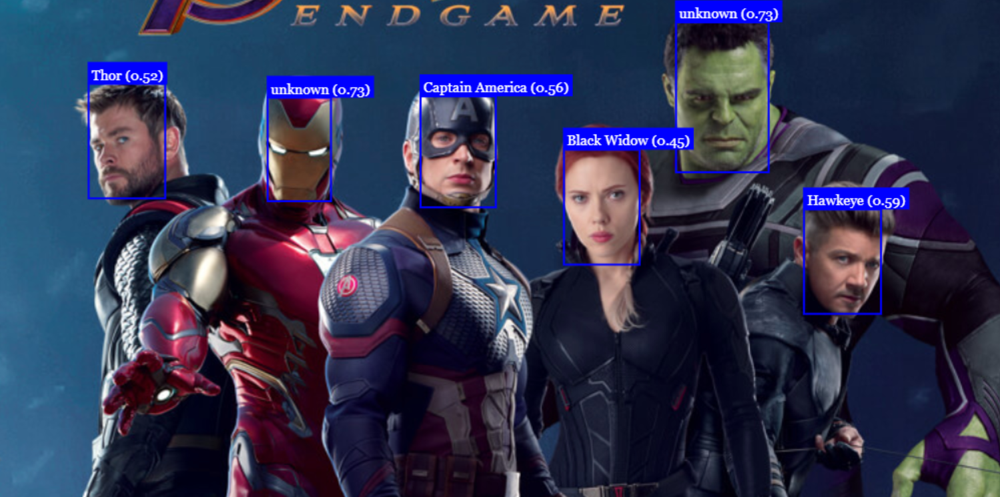

# Face Detection

A Face detection with [FaceApi](https://github.com/justadudewhohacks/face-api.js) library

## Technologies Used

I used the Face Api library based on TensorFlow for face recognition. CSS for formatting canvas and body elements. HTML for structure & javascript for intelligence.

